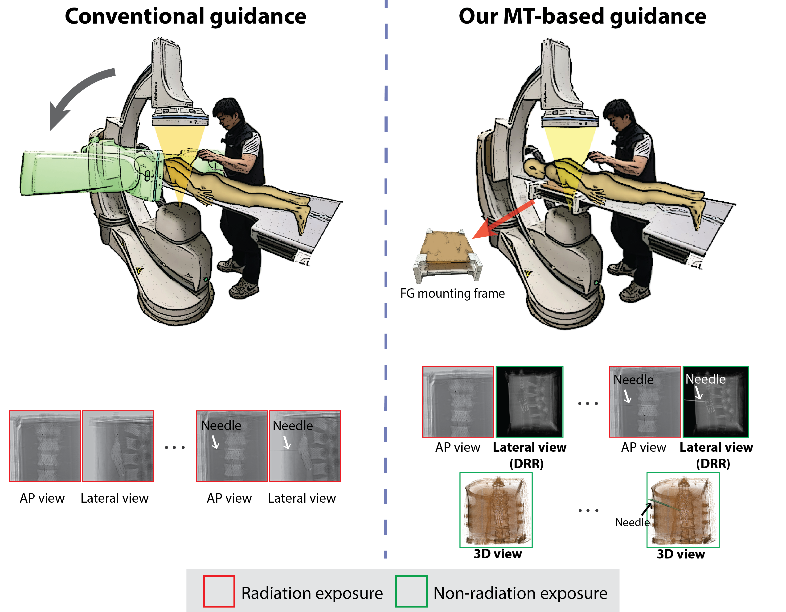
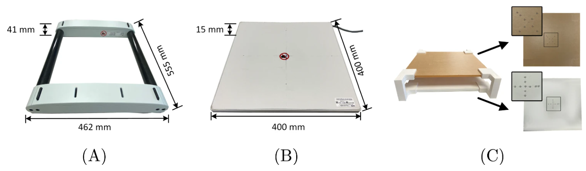
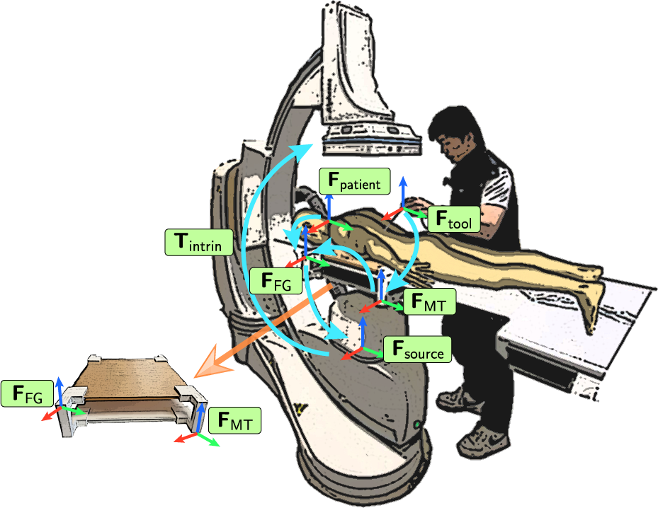
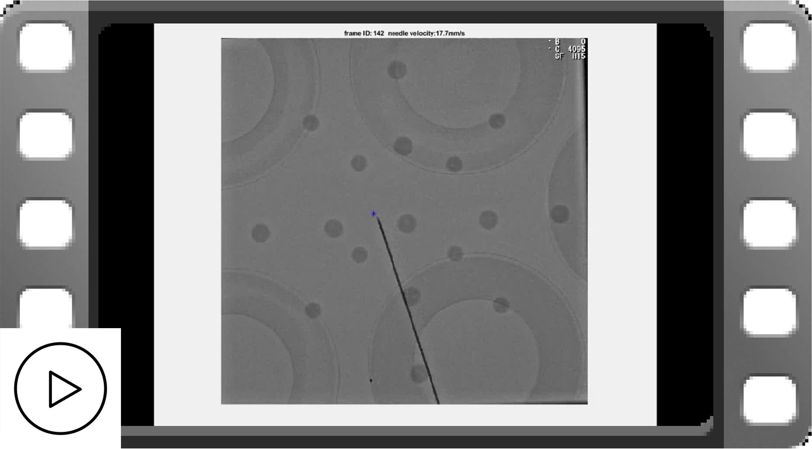
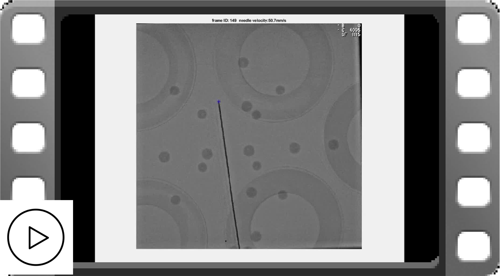
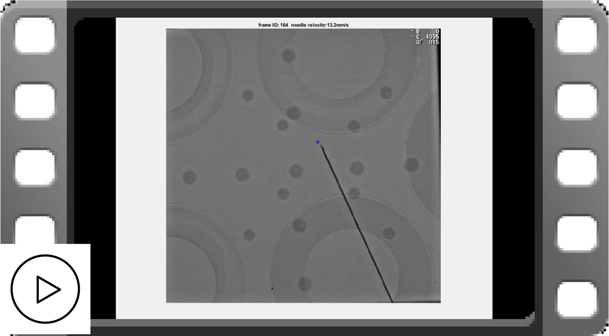
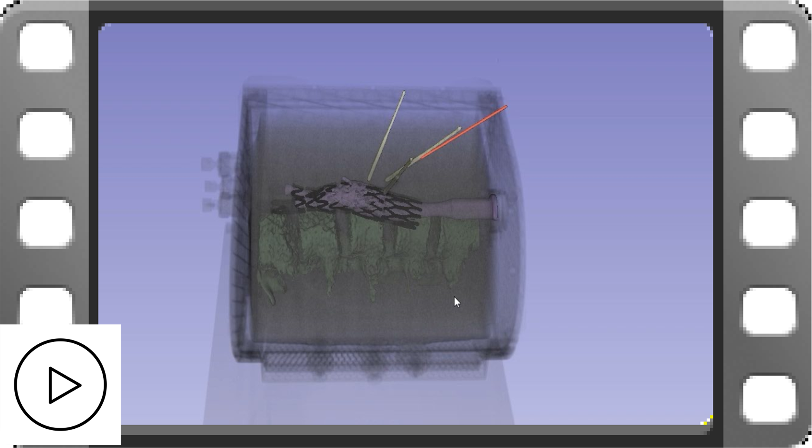
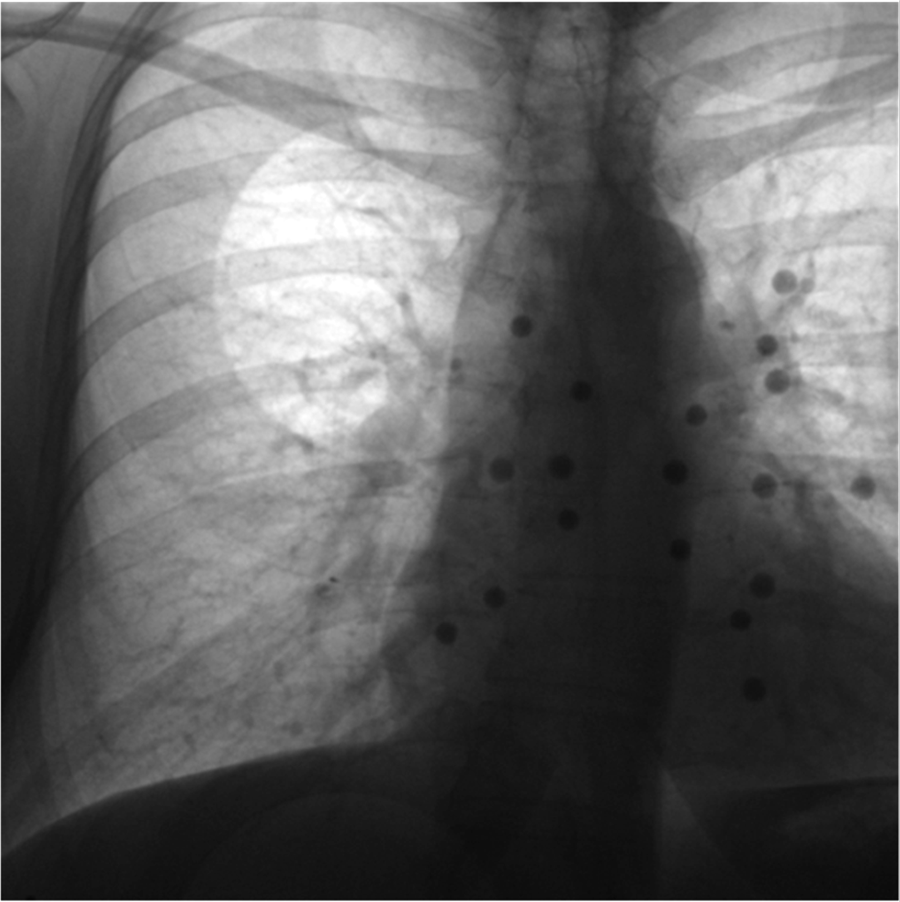

<!--  -->

  <h1>FLUX-NAV: Seamless Integration of Magnetic Tracking (FLUX) into FLuoroscopy NAVigation </h1>

<a href="https://scholar.google.com/citations?user=pPSHM1kAAAAJ&hl=en" target="_blank" rel="noopener noreferrer">
  Shuwei Xing, PhD;&nbsp; 
</a>

<a href="https://www.robarts.ca/research/scientists/peters_terry.html" target="_blank" rel="noopener noreferrer">
  Terry M. Peters, PhD; &nbsp; 
</a>
<a href="https://www.schulich.uwo.ca/medimaging//people/bios/faculty/derek_cool.html" target="_blank" rel="noopener noreferrer">
  Elvis C.S. Chen, PhD 
</a> 

<a>
  Robarts Research Institute, Western University, Canada
</a>

## FLUX-NAV system

## Overview

  X-ray fluoroscopy continues to be the predominant modality for intra-operative image guidance, ubiquitously employed across various domains including cardiovascular, endovascular, orthopedic, and neuro-interventions, as well as in pain management and biopsies. The 2D projective nature of X-ray radiography presents significant limitations in fluoroscopy-guided interventions, particularly the loss of depth perception and prolonged radiation exposure. Integrating magnetic trackers into these workflows is promising; however, it remains challenging and under-explored in current research and practice. To address this, we employed a radiolucent magnetic field generator (FG) prototype as a foundational step towards seamless magnetic tracking (MT) integration, see Figure 1. Overall, we demonstrated the efficacy and clinical applicability of the MT-assisted approach. To the best of our knowledge, this is the first study to integrate a radiolucent FG into a fluoroscopy-guided workflow.

  
   
  <a>Figure 1. Comparison of our proposed MT-assisted guidance system with the conventional one.</a>

### Radilucent field generator & our mounting frame

  

  In our work, we employed a magnetic tracking system, featuring a prototype radiolucent FG (TTFG45-55T) (<a href="https://www.ndigital.com/" target="_blank" rel="noopener noreferrer">Northern Digital Inc.</a>, Ontario, Canada). The unique construction with radiolucent materials results in a reduction of metal-induced imaging artifacts in X-ray radiographs when placed under the path of the X-ray beam compared to other conventional field generators. The radiolucent FG prototype also has a thinner profile than the window FG, and the form factor of a tabletop design enables easy integration with the surgical bed, as shown in Figure 2. 

  
   
  <a align="justify">Figure 2. Comparison of the window FG (A) with the radiolucent FG prototype (B) and the FG mounting frame (C). The top layer of the FG mounting frame comprises an acrylic plate, and the bottom layer houses the radiolucent FG prototype. Fiducials are attached to the downside of each layer.</a>

### System setup
Figure 3 shows the setup of our FLUX-NAV system. The FG mounting frame is placed on the surgical bed without interrupting the clinical workflow. 
 

  
   
  <a align="justify">Figure 3. FLUX-NAV system setup and coordinate frames for 2D and 3D navigation. </a>

### 2D FLUX-NAV: Virtual augmentation on 2D fluoroscopy

The virtual instrument roadmap provides real-time pose information of the surgical instrument on static fluoroscopic images, while reducing continuous radiation exposure. In 2D FLUX-NAV, the tracked instrument tip is virtually augmented on 2D fluoroscopy images. The following videos showed the tracking accuracy of the surgical instrument at anterior-posterior(AP), left-anterior-oblique (LAO) 10 degrees and right-anterior-oblique (RAO) 10 degrees, respectively.

 
<table align="center" border="0" cellspacing="0" cellpadding="0" style="border:none !important; border-collapse:collapse !important; border-spacing:0 !important; border-top:0 !important; border-bottom:0 !important;">
  <tr>
    <td align="center" width="30%" style="border:none !important; padding:0 !important;">
      
       
      <a>🎬 FLUX-NAV: Virtual augmentation-AP</a>
    </td>
    <td align="center" width="30%" style="border:none !important; padding:0 !important;">
      
       
      <a>🎬 FLUX-NAV: Virtual augmentation-LAO</a>
    </td>
    <td align="center" width="30%" style="border:none !important; padding:0 !important;">
      
       
      <a>🎬 FLUX-NAV: Virtual augmentation-RAO</a>
    </td>
  </tr>
</table>

### 3D FLUX-NAV: 3D Navigation

The FLUX-NAV system also supports 3D navigation, as demonstrated in the following video. An endoleak phantom was used to perform three needle/instrument insertions. To validate the navigation accuracy, a post-insertion CT scan was acquired and compared with the corresponding magnetically tracked needle positions.

      
       
      <a>🎬 FLUX-NAV: Virtual augmentation on phantom insertion</a>

## Project 1: Improved Image Quality: X-ray/Fluoroscopy decomposition

  

  
   
  <a align="justify">Figure 4. X-ray/Fluoroscopy image decomposition. </a>

## Project 2: Reduced Prolonged Radiation Exposure: Virtual fluoroscopy

  

## Project 3: Improved 3D Navigation: Fluoro-CT registration

### Global rigid fluoro-CT registration

  

### Local rigid Fluoro-CT registration (Ongoing)

## Project 4:  Clinical applications

### Endoleak Repair Procedure

### Spine Tumour Ablation (Ongoing)

### ... (Ongoing)

